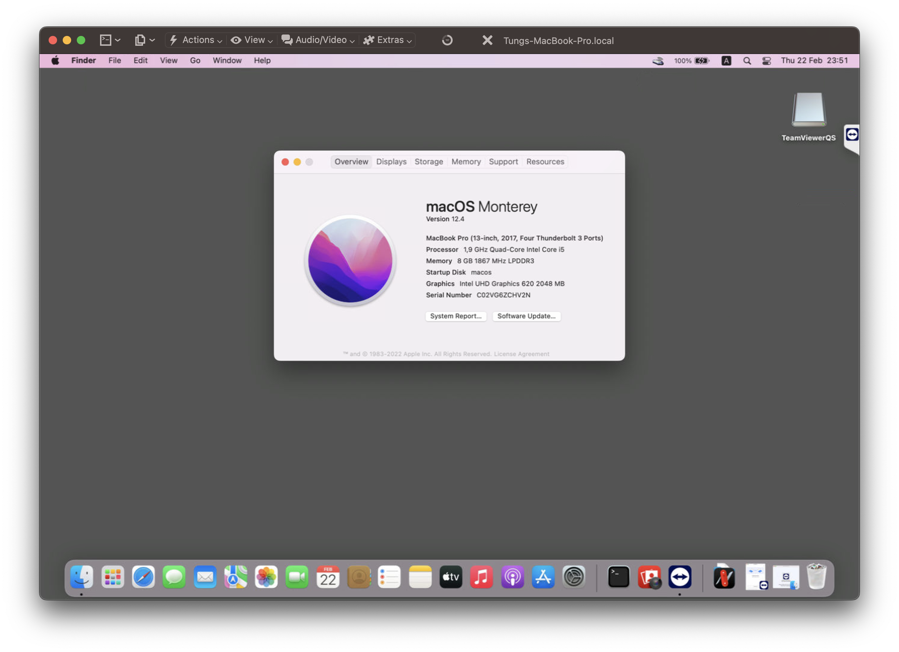

# Surface Pro 6 Hackintosh

# Specs:
- CPU: Intel i5-8350U
- GPU: Intel UHD Graphics 620
- RAM: 8GB LPDDR3 1866 MHz

# Working:
- Intel HD Graphics 
- Restart and Shutdown
- CPU Power Management
- Audio
- Touchpad
- All USB Ports

# Not Working:
- Wifi/ Bluetooth/ Airdrop
- Camera

# Screenshot:

# Credits
- Apple for macOS.
- Acidanthera for OpenCore and all the lovely hackintosh work.
- corpnewt For offline installer.
- Dortania For great and detailed guides.
- VNOHackintosh Support group for installation and post installation.
